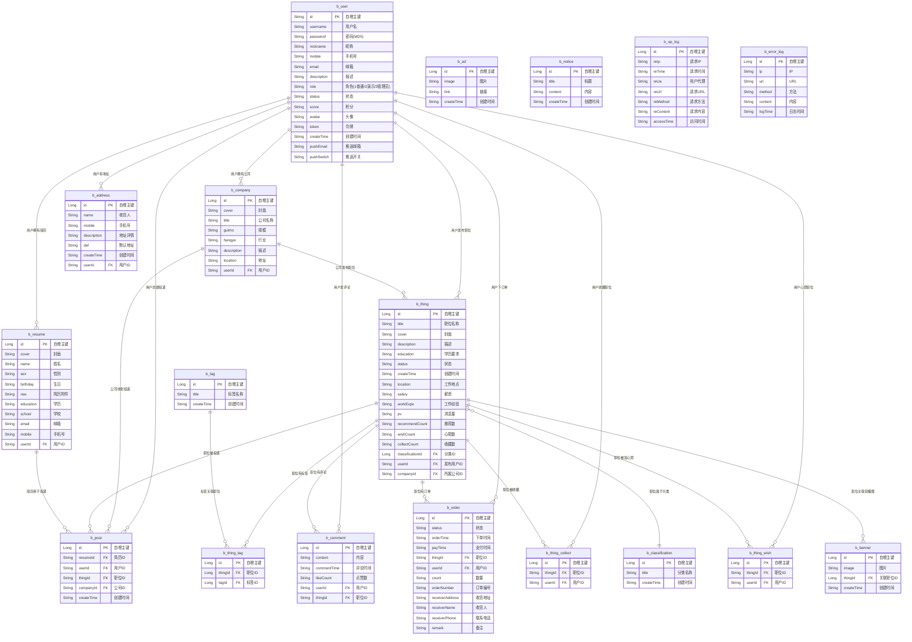

# Job System ER 图

> 数据库: MySQL (`java_job`) | ORM: MyBatis Plus 3.5.2
> 源码路径: `/server/src/main/java/com/gk/study/entity/`

---

## ER 关系图 (Mermaid)

---

## 关系汇总

| 关系 | 类型 | 说明 |
|------|------|------|
| b_user → b_company | 一对多 | 用户创建/拥有公司 |
| b_user → b_thing | 一对多 | 用户发布职位 |
| b_user → b_resume | 一对多 | 用户拥有简历 |
| b_user → b_post | 一对多 | 用户创建投递记录 |
| b_user → b_order | 一对多 | 用户下订单 |
| b_user → b_comment | 一对多 | 用户发表评论 |
| b_user → b_thing_collect | 一对多 | 用户收藏职位 |
| b_user → b_thing_wish | 一对多 | 用户加心愿 |
| b_user → b_address | 一对多 | 用户有收货地址 |
| b_company → b_thing | 一对多 | 公司发布职位 |
| b_company → b_post | 一对多 | 公司收到投递 |
| b_classification → b_thing | 一对多 | 分类下有多个职位 |
| b_thing ↔ b_tag | 多对多 | 通过 b_thing_tag 关联 |
| b_thing → b_comment | 一对多 | 职位有多条评论 |
| b_thing → b_order | 一对多 | 职位有多个订单 |
| b_thing → b_thing_collect | 一对多 | 职位被多次收藏 |
| b_thing → b_thing_wish | 一对多 | 职位被多次加心愿 |
| b_thing → b_banner | 一对多 | 职位关联轮播图 |
| b_resume → b_post | 一对多 | 简历用于多次投递 |

---

## 独立表（无外键关联）

| 表名 | 说明 |
|------|------|
| b_ad | 广告，独立无外键 |
| b_notice | 公告，独立无外键 |
| b_op_log | 操作日志，独立无外键 |
| b_error_log | 错误日志，独立无外键 |

---

## 注意事项

- 所有字段均为 VARCHAR 存储时间（非 DATETIME/TIMESTAMP）
- 外键约束由应用层逻辑维护，数据库层无 FOREIGN KEY 约束
- b_user.id 为 String 自增，其余表 id 为 Long 自增
- b_thing_tag 为 b_thing 与 b_tag 的多对多关联表
