# 1. 用例图 (Use Case Diagram)

> **用途**: 描述系统功能需求，展示不同角色（用户、管理员）可执行的操作
> **阶段**: 需求分析阶段

```mermaid
graph TB
    subgraph actors["参与者"]
        User(("👤 普通用户"))
        Admin(("🛡️ 管理员"))
    end

    subgraph system["招聘系统"]
        direction TB

        subgraph uc_user["用户管理"]
            UC01["注册账号"]
            UC02["用户登录"]
            UC03["修改个人信息"]
            UC04["修改密码"]
        end

        subgraph uc_thing["职位管理"]
            UC05["浏览职位列表"]
            UC06["查看职位详情"]
            UC07["搜索/筛选职位"]
            UC08["发布职位"]
            UC09["编辑职位"]
            UC10["删除职位"]
        end

        subgraph uc_interact["用户互动"]
            UC11["收藏职位"]
            UC12["取消收藏"]
            UC13["加入心愿单"]
            UC14["评论职位"]
            UC15["点赞评论"]
        end

        subgraph uc_resume["简历与投递"]
            UC16["创建简历"]
            UC17["编辑简历"]
            UC18["投递职位"]
            UC19["查看投递记录"]
        end

        subgraph uc_company["公司管理"]
            UC20["浏览公司"]
            UC21["创建公司"]
            UC22["编辑公司"]
        end

        subgraph uc_order["订单管理"]
            UC23["创建订单"]
            UC24["取消订单"]
            UC25["管理订单"]
        end

        subgraph uc_address["地址管理"]
            UC26["管理收货地址"]
        end

        subgraph uc_content["内容管理"]
            UC27["管理广告"]
            UC28["管理轮播图"]
            UC29["管理公告"]
            UC30["管理分类/标签"]
        end

        subgraph uc_system["系统管理"]
            UC31["用户管理"]
            UC32["查看系统信息"]
            UC33["查看统计数据"]
            UC34["查看操作日志"]
            UC35["查看错误日志"]
        end
    end

    %% 普通用户用例
    User --> UC01
    User --> UC02
    User --> UC03
    User --> UC04
    User --> UC05
    User --> UC06
    User --> UC07
    User --> UC11
    User --> UC12
    User --> UC13
    User --> UC14
    User --> UC15
    User --> UC16
    User --> UC17
    User --> UC18
    User --> UC19
    User --> UC20
    User --> UC23
    User --> UC24
    User --> UC26

    %% 管理员用例（继承普通用户 + 额外权限）
    Admin --> UC02
    Admin --> UC05
    Admin --> UC06
    Admin --> UC07
    Admin --> UC08
    Admin --> UC09
    Admin --> UC10
    Admin --> UC21
    Admin --> UC22
    Admin --> UC25
    Admin --> UC27
    Admin --> UC28
    Admin --> UC29
    Admin --> UC30
    Admin --> UC31
    Admin --> UC32
    Admin --> UC33
    Admin --> UC34
    Admin --> UC35
```

## 参与者说明

| 参与者 | 角色值 | 权限范围 |
|--------|--------|----------|
| 普通用户 | role=1 | 注册登录、浏览职位、收藏/心愿/评论、简历管理、投递职位、订单管理 |
| 管理员 | role=3 | 拥有所有权限，额外可管理职位/公司/用户/广告/轮播图/公告/分类标签/系统监控 |
