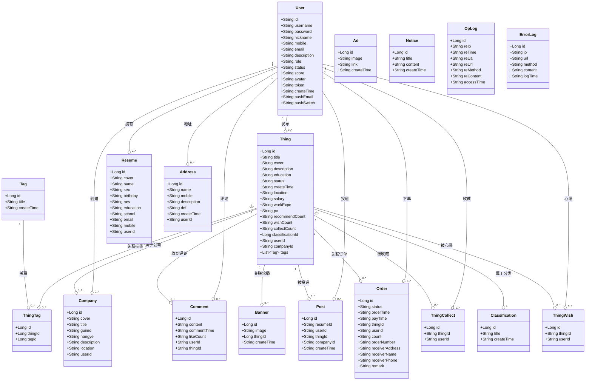

# 2. 类图 (Class Diagram)

> **用途**: 描述系统静态结构，展示实体类及其属性、方法和关联关系
> **阶段**: 系统设计阶段（面向对象分析与设计）

```mermaid
classDiagram
    direction TB

    class User {
        +String id
        +String username
        +String password
        +String nickname
        +String mobile
        +String email
        +String description
        +String role
        +String status
        +String score
        +String avatar
        +String token
        +String createTime
        +String pushEmail
        +String pushSwitch
    }

    class Company {
        +Long id
        +String cover
        +String title
        +String guimo
        +String hangye
        +String description
        +String location
        +String userId
    }

    class Thing {
        +Long id
        +String title
        +String cover
        +String description
        +String education
        +String status
        +String createTime
        +String location
        +String salary
        +String workExpe
        +String pv
        +String recommendCount
        +String wishCount
        +String collectCount
        +Long classificationId
        +String userId
        +String companyId
        +List~Tag~ tags
    }

    class Classification {
        +Long id
        +String title
        +String createTime
    }

    class Tag {
        +Long id
        +String title
        +String createTime
    }

    class ThingTag {
        +Long id
        +Long thingId
        +Long tagId
    }

    class Resume {
        +Long id
        +String cover
        +String name
        +String sex
        +String birthday
        +String raw
        +String education
        +String school
        +String email
        +String mobile
        +String userId
    }

    class Post {
        +Long id
        +String resumeId
        +String userId
        +String thingId
        +String companyId
        +String createTime
    }

    class Order {
        +Long id
        +String status
        +String orderTime
        +String payTime
        +String thingId
        +String userId
        +String count
        +String orderNumber
        +String receiverAddress
        +String receiverName
        +String receiverPhone
        +String remark
    }

    class Comment {
        +Long id
        +String content
        +String commentTime
        +String likeCount
        +String userId
        +String thingId
    }

    class ThingCollect {
        +Long id
        +String thingId
        +String userId
    }

    class ThingWish {
        +Long id
        +String thingId
        +String userId
    }

    class Address {
        +Long id
        +String name
        +String mobile
        +String description
        +String def
        +String createTime
        +String userId
    }

    class Ad {
        +Long id
        +String image
        +String link
        +String createTime
    }

    class Banner {
        +Long id
        +String image
        +Long thingId
        +String createTime
    }

    class Notice {
        +Long id
        +String title
        +String content
        +String createTime
    }

    class OpLog {
        +Long id
        +String reIp
        +String reTime
        +String reUa
        +String reUrl
        +String reMethod
        +String reContent
        +String accessTime
    }

    class ErrorLog {
        +Long id
        +String ip
        +String url
        +String method
        +String content
        +String logTime
    }

    %% User 关系
    User "1" --o "0..*" Company : 创建
    User "1" --o "0..*" Thing : 发布
    User "1" --o "0..*" Resume : 拥有
    User "1" --o "0..*" Post : 投递
    User "1" --o "0..*" Order : 下单
    User "1" --o "0..*" Comment : 评论
    User "1" --o "0..*" ThingCollect : 收藏
    User "1" --o "0..*" ThingWish : 心愿
    User "1" --o "0..*" Address : 地址

    %% Thing 关系
    Thing "1" --o "0..*" Comment : 收到评论
    Thing "1" --o "0..*" ThingCollect : 被收藏
    Thing "1" --o "0..*" ThingWish : 被心愿
    Thing "1" --o "0..*" Order : 关联订单
    Thing "1" --o "0..*" Post : 被投递
    Thing "1" --o "0..*" ThingTag : 关联标签
    Thing "1" --o "0..*" Banner : 关联轮播
    Thing "0..*" --o "1" Classification : 属于分类
    Thing "0..*" --o "0..1" Company : 属于公司

    %% Tag 多对多
    Tag "1" --o "0..*" ThingTag : 关联
```
