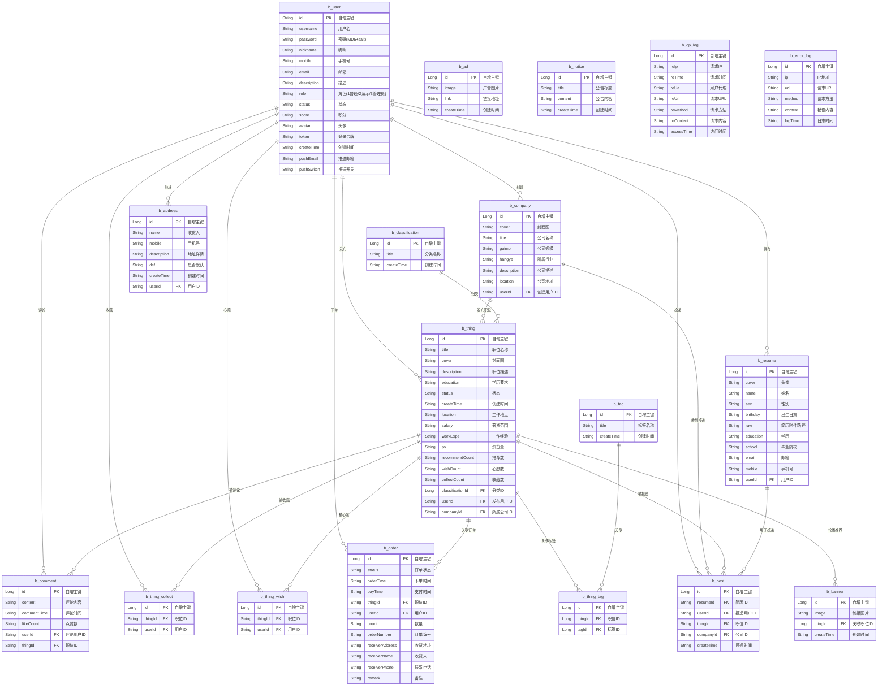

# 3. ER 图 (实体关系图 / 数据模型)

> **用途**: 描述数据库表结构及表间关系，指导数据库设计和数据建模
> **阶段**: 数据库设计阶段

```mermaid
erDiagram
    b_user {
        String id PK "自增主键"
        String username "用户名"
        String password "密码(MD5+salt)"
        String nickname "昵称"
        String mobile "手机号"
        String email "邮箱"
        String description "描述"
        String role "角色(1普通/2演示/3管理员)"
        String status "状态"
        String score "积分"
        String avatar "头像"
        String token "登录令牌"
        String createTime "创建时间"
        String pushEmail "推送邮箱"
        String pushSwitch "推送开关"
    }

    b_company {
        Long id PK "自增主键"
        String cover "封面图"
        String title "公司名称"
        String guimo "公司规模"
        String hangye "所属行业"
        String description "公司描述"
        String location "公司地址"
        String userId FK "创建用户ID"
    }

    b_thing {
        Long id PK "自增主键"
        String title "职位名称"
        String cover "封面图"
        String description "职位描述"
        String education "学历要求"
        String status "状态"
        String createTime "创建时间"
        String location "工作地点"
        String salary "薪资范围"
        String workExpe "工作经验"
        String pv "浏览量"
        String recommendCount "推荐数"
        String wishCount "心愿数"
        String collectCount "收藏数"
        Long classificationId FK "分类ID"
        String userId FK "发布用户ID"
        String companyId FK "所属公司ID"
    }

    b_classification {
        Long id PK "自增主键"
        String title "分类名称"
        String createTime "创建时间"
    }

    b_tag {
        Long id PK "自增主键"
        String title "标签名称"
        String createTime "创建时间"
    }

    b_thing_tag {
        Long id PK "自增主键"
        Long thingId FK "职位ID"
        Long tagId FK "标签ID"
    }

    b_resume {
        Long id PK "自增主键"
        String cover "头像"
        String name "姓名"
        String sex "性别"
        String birthday "出生日期"
        String raw "简历附件路径"
        String education "学历"
        String school "毕业院校"
        String email "邮箱"
        String mobile "手机号"
        String userId FK "用户ID"
    }

    b_post {
        Long id PK "自增主键"
        String resumeId FK "简历ID"
        String userId FK "投递用户ID"
        String thingId FK "职位ID"
        String companyId FK "公司ID"
        String createTime "投递时间"
    }

    b_order {
        Long id PK "自增主键"
        String status "订单状态"
        String orderTime "下单时间"
        String payTime "支付时间"
        String thingId FK "职位ID"
        String userId FK "用户ID"
        String count "数量"
        String orderNumber "订单编号"
        String receiverAddress "收货地址"
        String receiverName "收货人"
        String receiverPhone "联系电话"
        String remark "备注"
    }

    b_comment {
        Long id PK "自增主键"
        String content "评论内容"
        String commentTime "评论时间"
        String likeCount "点赞数"
        String userId FK "评论用户ID"
        String thingId FK "职位ID"
    }

    b_thing_collect {
        Long id PK "自增主键"
        String thingId FK "职位ID"
        String userId FK "用户ID"
    }

    b_thing_wish {
        Long id PK "自增主键"
        String thingId FK "职位ID"
        String userId FK "用户ID"
    }

    b_address {
        Long id PK "自增主键"
        String name "收货人"
        String mobile "手机号"
        String description "地址详情"
        String def "是否默认"
        String createTime "创建时间"
        String userId FK "用户ID"
    }

    b_ad {
        Long id PK "自增主键"
        String image "广告图片"
        String link "链接地址"
        String createTime "创建时间"
    }

    b_banner {
        Long id PK "自增主键"
        String image "轮播图片"
        Long thingId FK "关联职位ID"
        String createTime "创建时间"
    }

    b_notice {
        Long id PK "自增主键"
        String title "公告标题"
        String content "公告内容"
        String createTime "创建时间"
    }

    b_op_log {
        Long id PK "自增主键"
        String reIp "请求IP"
        String reTime "请求时间"
        String reUa "用户代理"
        String reUrl "请求URL"
        String reMethod "请求方法"
        String reContent "请求内容"
        String accessTime "访问时间"
    }

    b_error_log {
        Long id PK "自增主键"
        String ip "IP地址"
        String url "请求URL"
        String method "请求方法"
        String content "错误内容"
        String logTime "日志时间"
    }

    b_user ||--o{ b_company : "创建"
    b_user ||--o{ b_thing : "发布"
    b_user ||--o{ b_resume : "拥有"
    b_user ||--o{ b_post : "投递"
    b_user ||--o{ b_order : "下单"
    b_user ||--o{ b_comment : "评论"
    b_user ||--o{ b_thing_collect : "收藏"
    b_user ||--o{ b_thing_wish : "心愿"
    b_user ||--o{ b_address : "地址"
    b_company ||--o{ b_thing : "发布职位"
    b_company ||--o{ b_post : "收到投递"
    b_classification ||--o{ b_thing : "归类"
    b_thing ||--o{ b_comment : "被评论"
    b_thing ||--o{ b_thing_collect : "被收藏"
    b_thing ||--o{ b_thing_wish : "被心愿"
    b_thing ||--o{ b_order : "关联订单"
    b_thing ||--o{ b_thing_tag : "关联标签"
    b_thing ||--o{ b_post : "被投递"
    b_thing ||--o{ b_banner : "轮播推荐"
    b_tag ||--o{ b_thing_tag : "关联"
    b_resume ||--o{ b_post : "用于投递"
```
