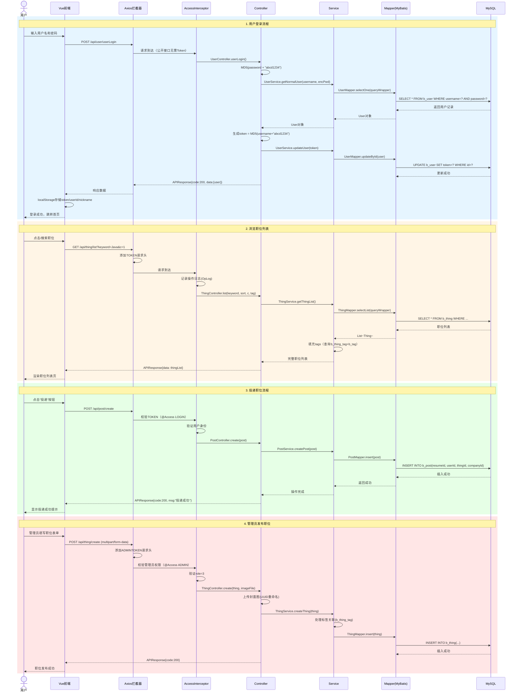

# 4. 时序图 (Sequence Diagram)

> **用途**: 描述用户登录 → 浏览职位 → 投递职位的完整交互时序
> **阶段**: 系统设计阶段（详细设计）

## 时序说明

| 序号 | 流程 | 涉及组件 | 权限要求 |
|------|------|----------|----------|
| 1 | 用户登录 | FE → Controller → Service → Mapper → DB | 公开 |
| 2 | 浏览职位 | FE → Interceptor → Controller → Service → DB | 公开 |
| 3 | 投递职位 | FE → Interceptor(验证) → Controller → Service → DB | LOGIN |
| 4 | 管理员发布 | FE → Interceptor(验证role=3) → Controller → Service → DB | ADMIN |
