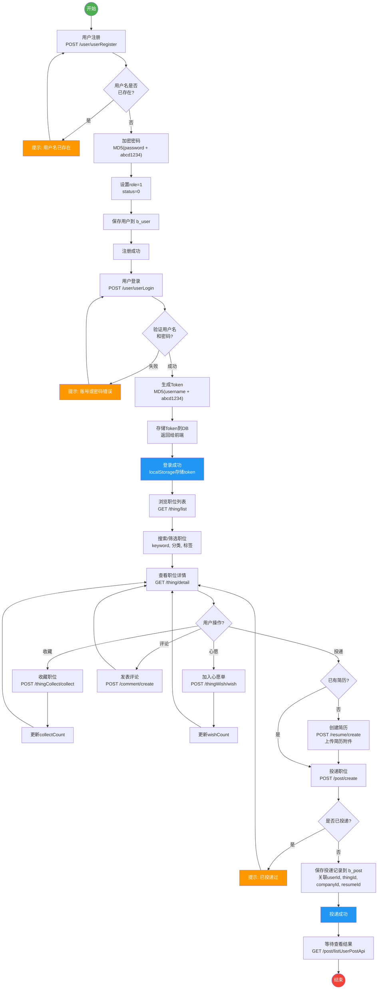

# 5. 活动图 (Activity Diagram)

> **用途**: 描述用户从注册到投递职位的完整业务活动流程
> **阶段**: 需求分析 / 系统设计阶段

```mermaid
flowchart TD
    START((开始)) --> Register["用户注册<br/>POST /user/userRegister"]

    Register --> CheckDup{用户名是否<br/>已存在?}
    CheckDup -->|是| RegisterFail["提示: 用户名已存在"]
    RegisterFail --> Register
    CheckDup -->|否| Encrypt["加密密码<br/>MD5(password + abcd1234)"]
    Encrypt --> SetRole["设置role=1<br/>status=0"]
    SetRole --> SaveUser["保存用户到 b_user"]
    SaveUser --> RegOK["注册成功"]

    RegOK --> Login["用户登录<br/>POST /user/userLogin"]
    Login --> ValCred{验证用户名<br/>和密码?}
    ValCred -->|失败| LoginFail["提示: 账号或密码错误"]
    LoginFail --> Login
    ValCred -->|成功| GenToken["生成Token<br/>MD5(username + abcd1234)"]
    GenToken --> StoreToken["存储Token到DB<br/>返回给前端"]
    StoreToken --> LoginOK["登录成功<br/>localStorage存储token"]

    LoginOK --> Browse["浏览职位列表<br/>GET /thing/list"]
    Browse --> Search["搜索/筛选职位<br/>keyword, 分类, 标签"]
    Search --> ViewDetail["查看职位详情<br/>GET /thing/detail"]

    ViewDetail --> Action{用户操作?}

    Action -->|收藏| Collect["收藏职位<br/>POST /thingCollect/collect"]
    Collect --> UpdateCollectCount["更新collectCount"]
    UpdateCollectCount --> ViewDetail

    Action -->|心愿| Wish["加入心愿单<br/>POST /thingWish/wish"]
    Wish --> UpdateWishCount["更新wishCount"]
    UpdateWishCount --> ViewDetail

    Action -->|评论| Comment["发表评论<br/>POST /comment/create"]
    Comment --> ViewDetail

    Action -->|投递| CheckResume{已有简历?}
    CheckResume -->|否| CreateResume["创建简历<br/>POST /resume/create<br/>上传简历附件"]
    CreateResume --> Apply
    CheckResume -->|是| Apply["投递职位<br/>POST /post/create"]

    Apply --> CheckApplied{是否已投递?}
    CheckApplied -->|是| AppliedTip["提示: 已投递过"]
    AppliedTip --> ViewDetail
    CheckApplied -->|否| SavePost["保存投递记录到 b_post<br/>关联userId, thingId, companyId, resumeId"]
    SavePost --> ApplyOK["投递成功"]

    ApplyOK --> WaitResult["等待查看结果<br/>GET /post/listUserPostApi"]
    WaitResult --> END((结束))

    style START fill:#4CAF50,color:#fff
    style END fill:#f44336,color:#fff
    style LoginOK fill:#2196F3,color:#fff
    style ApplyOK fill:#2196F3,color:#fff
    style RegisterFail fill:#FF9800,color:#fff
    style LoginFail fill:#FF9800,color:#fff
    style AppliedTip fill:#FF9800,color:#fff
```
