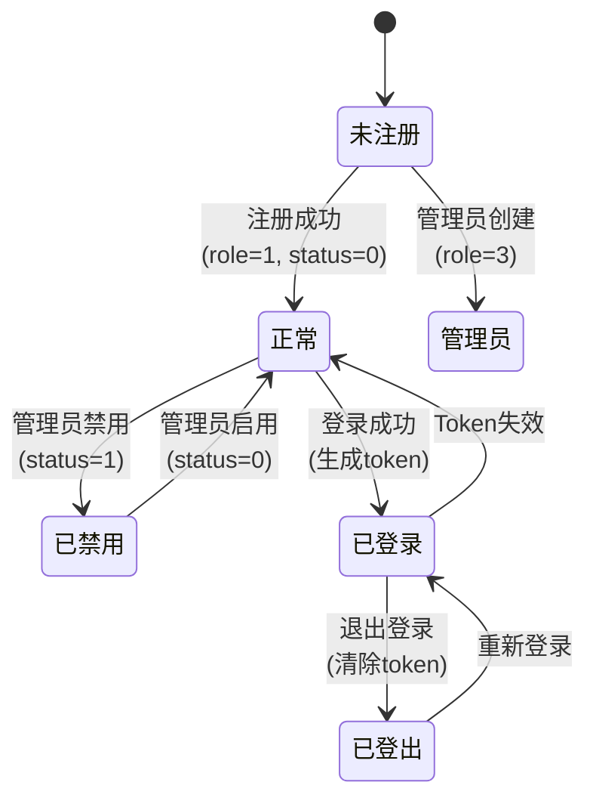
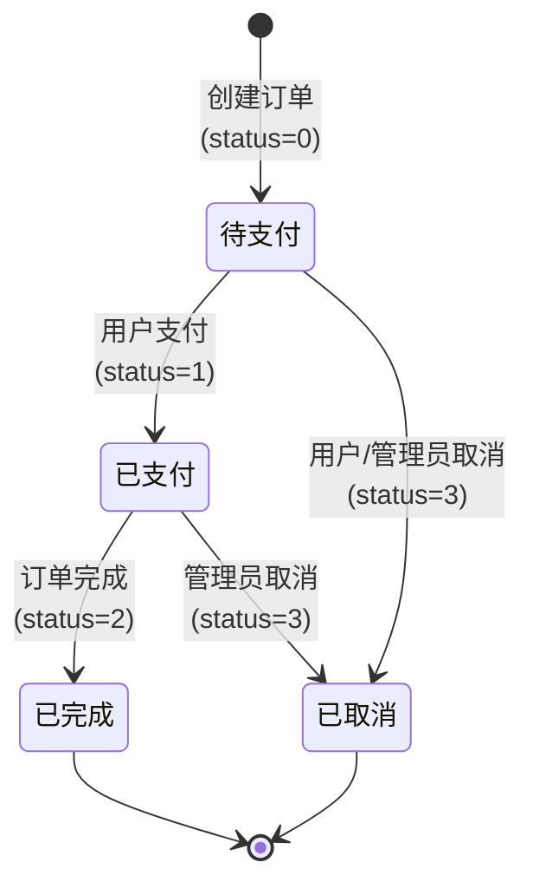
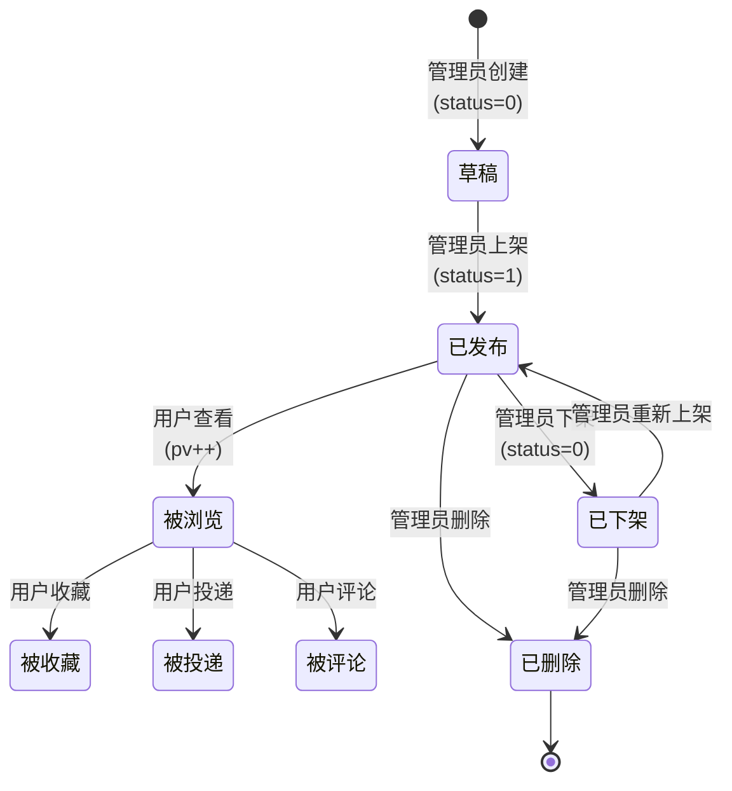
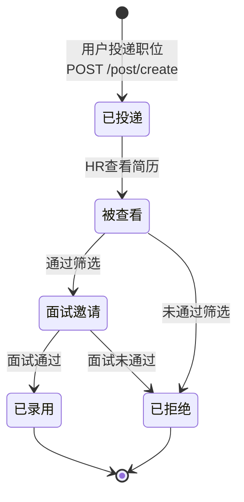

# 6. 状态图 (State Diagram)

> **用途**: 描述核心实体（用户、订单、职位）在其生命周期中的状态变迁
> **阶段**: 系统设计阶段（详细设计）

## 6.1 用户状态图

## 6.2 订单状态图

## 6.3 职位状态图

## 6.4 投递状态流转

## 状态值映射

| 实体 | 状态字段 | 值 | 含义 |
|------|----------|----|------|
| 用户 | status | 0 | 正常 |
| 用户 | status | 1 | 禁用 |
| 用户 | role | 1 | 普通用户 |
| 用户 | role | 2 | 演示账号 |
| 用户 | role | 3 | 管理员 |
| 订单 | status | 0 | 待支付 |
| 订单 | status | 1 | 已支付 |
| 订单 | status | 2 | 已完成 |
| 订单 | status | 3 | 已取消 |
| 职位 | status | 0 | 下架/草稿 |
| 职位 | status | 1 | 已发布 |
