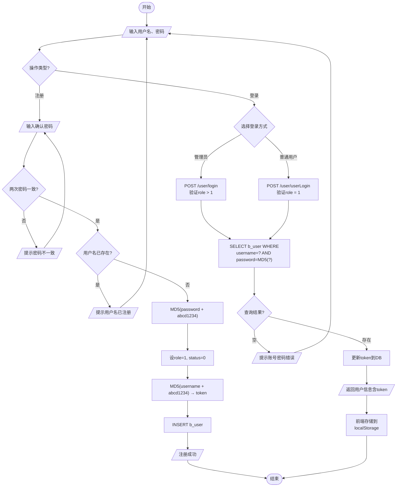
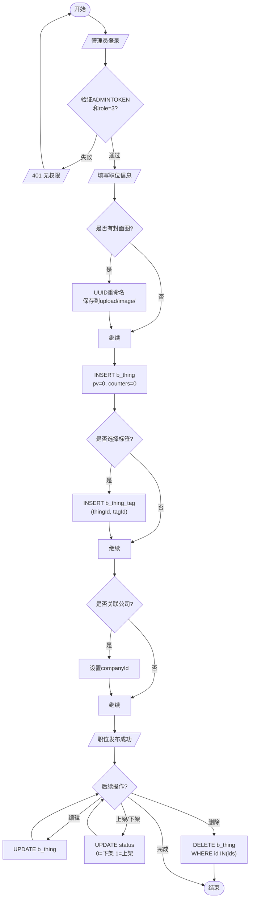
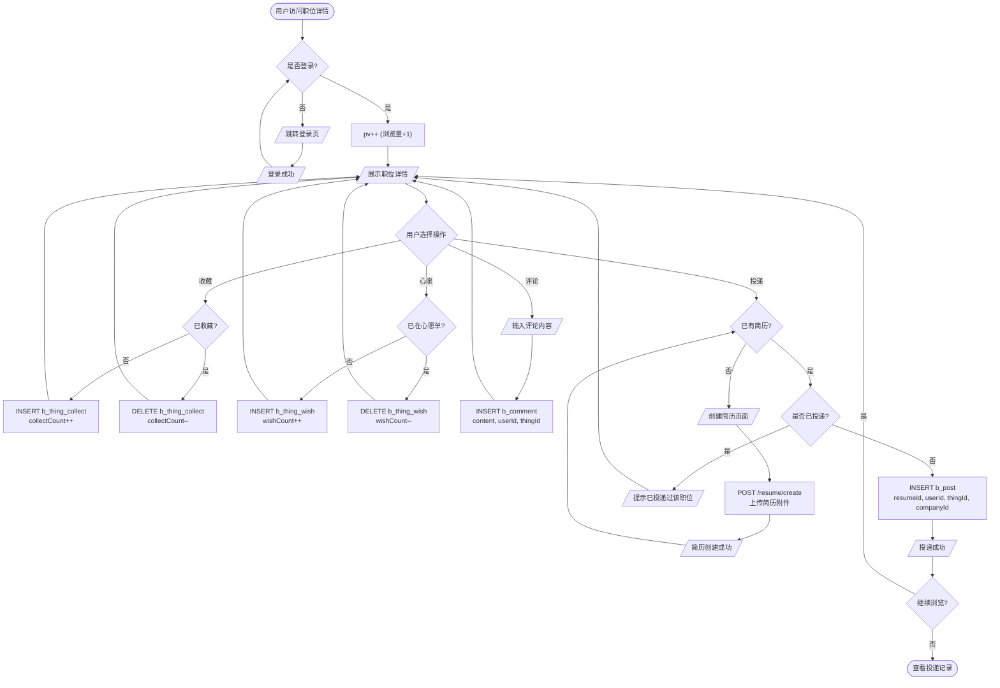

# 7. 流程图 (Flowchart)

> **用途**: 描述系统核心业务流程的处理逻辑
> **阶段**: 需求分析 / 系统设计阶段

## 7.1 用户注册登录流程

```mermaid
flowchart TD
    A([开始]) --> B[/输入用户名、密码/]
    B --> C{操作类型?}

    C -->|注册| D[/输入确认密码/]
    D --> E{两次密码一致?}
    E -->|否| F[/提示密码不一致/] --> D
    E -->|是| G{用户名已存在?}
    G -->|是| H[/提示用户名已注册/] --> B
    G -->|否| I["MD5(password + abcd1234)"]
    I --> J["设role=1, status=0"]
    J --> K["MD5(username + abcd1234) → token"]
    K --> L["INSERT b_user"]
    L --> M[/注册成功/] --> N([结束])

    C -->|登录| O{选择登录方式}
    O -->|管理员| P["POST /user/login<br/>验证role > 1"]
    O -->|普通用户| Q["POST /user/userLogin<br/>验证role = 1"]

    P --> R["SELECT b_user WHERE<br/>username=? AND password=MD5(?)"]
    Q --> R
    R --> S{查询结果?}
    S -->|空| T[/提示账号密码错误/] --> B
    S -->|存在| U["更新token到DB"]
    U --> V[/返回用户信息含token/]
    V --> W["前端存储到<br/>localStorage"]
    W --> N
```

## 7.2 职位发布与管理流程

```mermaid
flowchart TD
    A([开始]) --> B[/管理员登录/]
    B --> C{验证ADMINTOKEN<br/>和role=3?}
    C -->|失败| D[/401 无权限/] --> A
    C -->|通过| E[/填写职位信息/]

    E --> F{是否有封面图?}
    F -->|是| G["UUID重命名<br/>保存到upload/image/"]
    F -->|否| H[继续]
    G --> H

    H --> I["INSERT b_thing<br/>pv=0, counters=0"]
    I --> J{是否选择标签?}
    J -->|是| K["INSERT b_thing_tag<br/>(thingId, tagId)"]
    J -->|否| L[继续]
    K --> L

    L --> M{是否关联公司?}
    M -->|是| N["设置companyId"]
    M -->|否| O[继续]
    N --> O

    O --> P[/职位发布成功/]

    P --> Q{后续操作?}
    Q -->|编辑| R["UPDATE b_thing"]
    R --> Q
    Q -->|上架/下架| S["UPDATE status<br/>0=下架 1=上架"]
    S --> Q
    Q -->|删除| T["DELETE b_thing<br/>WHERE id IN(ids)"]
    T --> U([结束])
    Q -->|完成| U
```

## 7.3 投递职位完整流程

```mermaid
flowchart TD
    A([用户访问职位详情]) --> B{是否登录?}
    B -->|否| C[/跳转登录页/]
    C --> D[/登录成功/]
    D --> B
    B -->|是| E["pv++ (浏览量+1)"]

    E --> F[/展示职位详情/]
    F --> G{用户选择操作}

    G -->|收藏| H{已收藏?}
    H -->|否| I["INSERT b_thing_collect<br/>collectCount++"]
    H -->|是| J["DELETE b_thing_collect<br/>collectCount--"]
    I --> F
    J --> F

    G -->|心愿| K{已在心愿单?}
    K -->|否| L["INSERT b_thing_wish<br/>wishCount++"]
    K -->|是| M["DELETE b_thing_wish<br/>wishCount--"]
    L --> F
    M --> F

    G -->|评论| N[/输入评论内容/]
    N --> O["INSERT b_comment<br/>content, userId, thingId"]
    O --> F

    G -->|投递| P{已有简历?}
    P -->|否| Q[/创建简历页面/]
    Q --> R["POST /resume/create<br/>上传简历附件"]
    R --> S[/简历创建成功/]
    S --> P
    P -->|是| T{是否已投递?}

    T -->|是| U[/提示已投递过该职位/] --> F
    T -->|否| V["INSERT b_post<br/>resumeId, userId, thingId, companyId"]
    V --> W[/投递成功/]
    W --> X{继续浏览?}
    X -->|是| F
    X -->|否| Y([查看投递记录])
```
