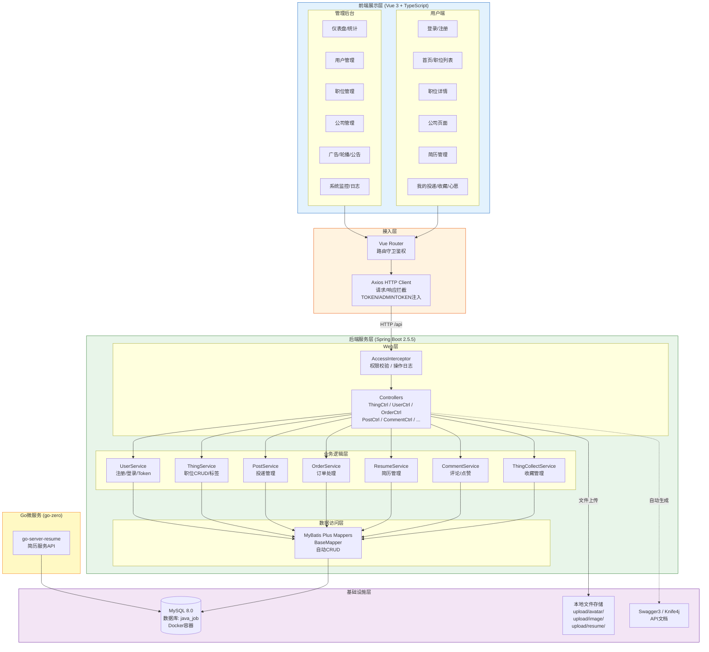

# 8. 系统架构图 (Architecture Diagram)

> **用途**: 描述系统整体分层架构和组件间的关系
> **阶段**: 系统架构设计阶段

## 架构说明

| 层级 | 技术 | 职责 |
|------|------|------|
| **前端展示层** | Vue 3 + TypeScript + Ant Design Vue + Pinia | 用户端/管理后台页面渲染与交互 |
| **接入层** | Vue Router + Axios | 路由守卫鉴权、HTTP请求拦截、Token注入 |
| **Web层** | Spring MVC + AccessInterceptor | 接收请求、权限校验(@Access)、操作日志记录 |
| **业务逻辑层** | Spring Service | 用户认证、职位管理、投递、订单等核心业务 |
| **数据访问层** | MyBatis Plus 3.5.2 | ORM映射、自动CRUD、SQL生成 |
| **Go微服务** | go-zero | 简历服务（独立微服务） |
| **基础设施层** | MySQL 8.0 + 本地文件系统 | 数据持久化、文件存储、API文档 |
