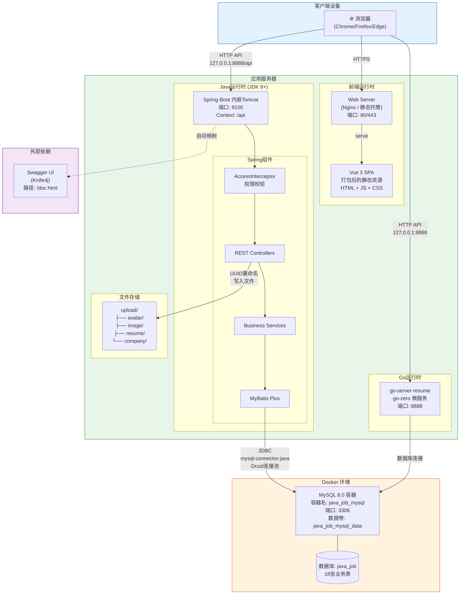

# 9. 部署图 (Deployment Diagram)

> **用途**: 描述系统在物理/运行环境中的部署拓扑
> **阶段**: 系统部署 / 运维阶段



## 部署节点说明

| 节点 | 技术 | 端口 | 说明 |
|------|------|------|------|
| 浏览器 | Chrome/Firefox | - | 用户访问入口，加载Vue SPA |
| Web Server | Nginx | 80/443 | 托管Vue前端静态资源 |
| Spring Boot | JDK 8+ / Tomcat | 9100 | Java后端REST API (context: /api) |
| Go Service | go-zero | 8888 | 简历微服务API |
| MySQL容器 | Docker / MySQL 8 | 3306 | 数据库服务 (docker-compose部署) |

## Docker Compose 配置

```yaml
# docker-compose.yml
services:
  mysql:
    image: mysql:8
    container_name: java_job_mysql
    ports: "3306:3306"
    environment:
      MYSQL_ROOT_PASSWORD: root123
      MYSQL_DATABASE: java_job
    volumes: mysql_data:/var/lib/mysql
```

## 关键配置

| 配置项 | 值 | 来源 |
|--------|-----|------|
| 后端端口 | 9100 | application.yml: server.port |
| API前缀 | /api | application.yml: server.servlet.context-path |
| 数据库 | java_job | application.yml: spring.datasource.url |
| 前端BASE_URL | http://127.0.0.1:8888 | web/src/store/constants.ts |
| 文件上传路径 | server/upload/ | application.yml: File.uploadPath |
| 密码加密 | MD5(明文 + abcd1234) | UserController |
| Token生成 | MD5(username + abcd1234) | UserController |
